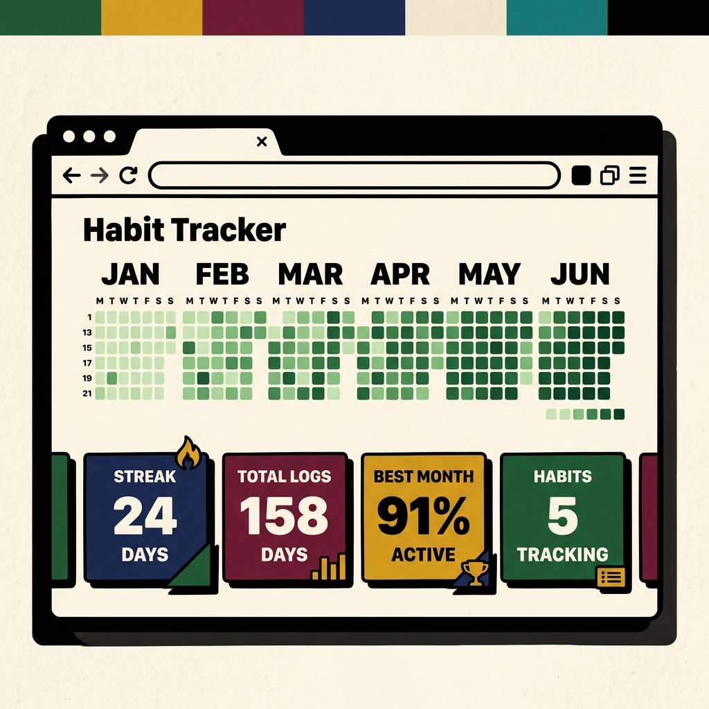

Build a Habit Heatmap Tracker with HTML, CSS, and JavaScript
Vishesh Jain

·
45 min read

·
Jun 27, 2026

Prerequisites
HTML, CSS, and JavaScript fundamentals

Versions
HTML5, CSS3, ES6+ JavaScript

# Introduction
Ever looked at your GitHub contribution graph and thought, "I wish I could track all my daily habits with these awesome little green squares"? Same! Contribution heatmaps are one of the most satisfying ways to visualize progress, consistency, and streaks over time.

What if we could build our very own habit tracking heatmap from scratch using pure web technologies? 🟩



In this project tutorial, we'll be using:

HTML for structure
CSS3 for custom styling and neo-brutalism design
Vanilla JavaScript for date math, DOM manipulation, and state management
A code editor (VS Code, Codédex Build, etc.)

# Setting Up the HTML Skeleton
First, let's create our project files and set up the main HTML structure. Create a folder named `habit-heatmap` with three files: `index.html`, `style.css`, and `app.js`.

Open `index.html` and let's start with our HTML boilerplate and external font imports:

```html
<!DOCTYPE html>
<html lang="en">
<head>
  <meta charset="UTF-8">
  <meta name="viewport" content="width=device-width, initial-scale=1.0">
  <title>Habit Heatmap Tracker</title>
  <link rel="icon" href="data:image/svg+xml,<svg xmlns=%22http://www.w3.org/2000/svg%22 viewBox=%220 0 100 100%22><text y=%22.9em%22 font-size=%2290%22>🟩</text></svg>">
  <link rel="preconnect" href="https://fonts.googleapis.com">
  <link rel="preconnect" href="https://fonts.gstatic.com" crossorigin>
  <link href="https://fonts.googleapis.com/css2?family=Space+Grotesk:wght@400;500;600;700&family=Space+Mono:wght@400;700&display=swap" rel="stylesheet">
  <link rel="stylesheet" href="style.css">
</head>
<body>
  <div class="accent-bar" aria-hidden="true"></div>
  <header class="header">
    <div class="header-content">
      <div class="logo">
        <span class="logo-badge" aria-hidden="true">🟩</span>
        <div>
          <h1>Habit Heatmap</h1>
          <p class="tagline">Track your daily habits, one square at a time</p>
        </div>
      </div>
    </div>
  </header>
```

We imported **Space Grotesk** and **Space Mono** from Google Fonts to give our project a bold, modern look. We also added an inline SVG favicon so our browser tab displays a green square icon!

Next, let's add the main container holding our habit selector bar, the heatmap card, and the statistics section:

```html
  <main class="container">
    <section class="habit-bar" aria-label="Habit selector">
      <div class="habit-pills" id="habit-pills"></div>
      <button class="add-habit-btn" id="add-habit-btn" aria-label="Add new habit">
        <span aria-hidden="true">+</span> New Habit
      </button>
    </section>

    <section class="heatmap-card" id="heatmap-card" aria-label="Activity heatmap">
      <div class="heatmap-card-header">
        <h2 class="heatmap-title">📊 Activity Grid</h2>
        <p class="heatmap-hint">Click to log · Right-click to undo</p>
      </div>
      <div class="heatmap-scroll">
        <div class="heatmap-months" id="heatmap-months" aria-hidden="true"></div>
        <div class="heatmap-body">
          <div class="heatmap-days" aria-hidden="true">
            <span></span>
            <span>Mon</span>
            <span></span>
            <span>Wed</span>
            <span></span>
            <span>Fri</span>
            <span></span>
          </div>
          <div class="heatmap-grid" id="heatmap-grid" role="grid" aria-label="Habit activity grid"></div>
        </div>
      </div>
      <div class="heatmap-footer">
        <div class="heatmap-level-guide">
          <span class="level-tag" data-level="1">1 = Light</span>
          <span class="level-tag" data-level="2">2 = Moderate</span>
          <span class="level-tag" data-level="3">3 = Strong</span>
          <span class="level-tag" data-level="4">4 = Intense</span>
        </div>
        <div class="heatmap-legend-wrapper">
          <span class="heatmap-legend-label">Less</span>
          <div class="heatmap-legend">
            <span class="legend-cell" data-level="0"></span>
            <span class="legend-cell" data-level="1"></span>
            <span class="legend-cell" data-level="2"></span>
            <span class="legend-cell" data-level="3"></span>
            <span class="legend-cell" data-level="4"></span>
          </div>
          <span class="heatmap-legend-label">More</span>
        </div>
      </div>
    </section>

    <section class="stats-grid" id="stats-grid" aria-label="Habit statistics">
      <div class="stat-card stat-card--fire">
        <div class="stat-icon" aria-hidden="true">🔥</div>
        <div class="stat-value" id="current-streak">0</div>
        <div class="stat-label">Current Streak</div>
      </div>
      <div class="stat-card stat-card--gold">
        <div class="stat-icon" aria-hidden="true">📈</div>
        <div class="stat-value" id="longest-streak">0</div>
        <div class="stat-label">Longest Streak</div>
      </div>
      <div class="stat-card stat-card--mint">
        <div class="stat-icon" aria-hidden="true">📊</div>
        <div class="stat-value" id="total-days">0</div>
        <div class="stat-label">Total Active</div>
      </div>
      <div class="stat-card stat-card--lavender">
        <div class="stat-icon" aria-hidden="true">📅</div>
        <div class="stat-value" id="this-year">0</div>
        <div class="stat-label">This Year</div>
      </div>
    </section>
  </main>
```

Finally, let's add our "Add Habit" modal overlay, tooltip container, and script tag at the bottom of the body:

```html
  <div class="modal-overlay" id="modal-overlay" role="dialog" aria-modal="true" aria-label="Add new habit">
    <div class="modal" id="modal">
      <div class="modal-header">
        <h2>✨ Add New Habit</h2>
        <button class="modal-close" id="modal-close" aria-label="Close dialog">&times;</button>
      </div>
      <div class="modal-body">
        <label class="input-label" for="habit-name">Habit Name</label>
        <input type="text" id="habit-name" class="text-input" placeholder="e.g., Morning Run" maxlength="24" autocomplete="off">
        <label class="input-label">Choose an Emoji</label>
        <div class="emoji-grid" id="emoji-grid"></div>
      </div>
      <div class="modal-footer">
        <button class="btn btn-secondary" id="modal-cancel">Cancel</button>
        <button class="btn btn-primary" id="modal-add">Add Habit</button>
      </div>
    </div>
  </div>

  <div class="tooltip" id="tooltip" role="tooltip">
    <span id="tooltip-text"></span>
  </div>

  <footer class="footer">
    <p>Built with 💚 using HTML, CSS &amp; JavaScript</p>
  </footer>

  <script src="app.js"></script>
</body>
</html>
```

Save your `index.html` file! Now let's jump into styling our project.

# Styling with Neo-Brutalism
Neo-brutalism is a popular design aesthetic using thick borders, distinct solid shadows, and high contrast colors. 🎨

Open `style.css` and let's define our CSS custom properties (variables):

```css
:root {
  --bg-canvas: #FBF7F0;
  --bg-card: #FFFFFF;
  --border-color: #2B2B2B;
  --border-width: 2.5px;
  --shadow-color: #2B2B2B;
  --shadow-sm: 3px 3px 0 #2B2B2B;
  --shadow-md: 5px 5px 0 #2B2B2B;
  --shadow-lg: 7px 7px 0 #2B2B2B;
  --text-primary: #2B2B2B;
  --text-secondary: #5C5C5C;
  --text-muted: #8A8A8A;

  --heat-0: #EDE8E0;
  --heat-1: #B8D4B8;
  --heat-2: #7BAE7F;
  --heat-3: #3A9E4A;
  --heat-4: #1B6E2E;

  --accent-green: #2D6A4F;
  --accent-red: #C0504D;
  --accent-gold: #D4A843;
  --accent-blue: #3D5A80;

  --tint-fire: #FFF0E6;
  --tint-gold: #FFF8E1;
  --tint-mint: #E8F5E9;
  --tint-lavender: #EDE7F6;

  --cell-size: 16px;
  --cell-gap: 4px;
  --cell-radius: 4px;
  --font-sans: 'Space Grotesk', sans-serif;
  --font-mono: 'Space Mono', monospace;
}
```

The `--heat-0` to `--heat-4` variables define our 5 intensity levels for the habit activity squares, ranging from light cream to deep forest green!

Now let's style the base layout and our neo-brutalism cards:

```css
body {
  font-family: var(--font-sans);
  background-color: var(--bg-canvas);
  color: var(--text-primary);
  min-height: 100vh;
  line-height: 1.5;
}

.container {
  max-width: 960px;
  margin: 0 auto;
  padding: 0 24px 60px;
}

.heatmap-card {
  background: var(--bg-card);
  border: var(--border-width) solid var(--border-color);
  border-radius: 16px;
  padding: 24px;
  margin-bottom: 24px;
  box-shadow: var(--shadow-md);
}
```

The key secret to creating a GitHub-style heatmap in CSS is using **CSS Grid** with `grid-auto-flow: column`. This tells the grid to fill top-to-bottom in columns (representing weeks) rather than left-to-right in rows! 📐

```css
.heatmap-grid {
  display: grid;
  grid-template-rows: repeat(7, var(--cell-size));
  grid-auto-flow: column;
  grid-auto-columns: var(--cell-size);
  gap: var(--cell-gap);
}

.heatmap-cell {
  width: var(--cell-size);
  height: var(--cell-size);
  border-radius: var(--cell-radius);
  border: 1.5px solid rgba(43, 43, 43, 0.12);
  background-color: var(--heat-0);
  cursor: pointer;
  transition: transform 120ms ease, background-color 120ms ease;
}

.heatmap-cell[data-level="0"] { background-color: var(--heat-0); }
.heatmap-cell[data-level="1"] { background-color: var(--heat-1); }
.heatmap-cell[data-level="2"] { background-color: var(--heat-2); }
.heatmap-cell[data-level="3"] { background-color: var(--heat-3); }
.heatmap-cell[data-level="4"] { background-color: var(--heat-4); }
```

Using attribute selectors like `.heatmap-cell[data-level="3"]` allows JavaScript to easily change cell colors simply by updating the cell's `data-level` attribute!

# State and Date Utilities
Now, let's open `app.js` and build our application state and helper functions. 🧠

We'll start by defining constants and loading our app state from `localStorage` so user entries persist even after refreshing the page!

```javascript
const STORAGE_KEY = 'habit-heatmap-data';

const DEFAULT_HABITS = [
  { id: 'h1', name: 'Code', emoji: '💻' },
  { id: 'h2', name: 'Read', emoji: '📚' },
  { id: 'h3', name: 'Exercise', emoji: '🏋️' },
];

function loadState() {
  const saved = localStorage.getItem(STORAGE_KEY);
  if (saved) {
    try {
      const parsed = JSON.parse(saved);
      if (parsed.habits && parsed.entries && parsed.activeHabitId) {
        return parsed;
      }
    } catch (e) {
      console.warn('Could not parse saved state, starting fresh.');
    }
  }

  const entries = {};
  DEFAULT_HABITS.forEach(h => (entries[h.id] = {}));
  return {
    habits: DEFAULT_HABITS.map(h => ({ ...h })),
    activeHabitId: DEFAULT_HABITS[0].id,
    entries,
  };
}

function saveState() {
  localStorage.setItem(STORAGE_KEY, JSON.stringify(state));
}

let state = loadState();
```

Next, we need helper functions to format dates into `YYYY-MM-DD` strings and generate all dates for the past 52 weeks:

```javascript
function formatDate(date) {
  const y = date.getFullYear();
  const m = String(date.getMonth() + 1).padStart(2, '0');
  const d = String(date.getDate()).padStart(2, '0');
  return `${y}-${m}-${d}`;
}

function getHeatmapDates() {
  const today = new Date();
  today.setHours(0, 0, 0, 0);

  const start = new Date(today);
  start.setDate(today.getDate() - today.getDay() - 52 * 7);

  const dates = [];
  const cursor = new Date(start);
  while (cursor <= today) {
    dates.push(new Date(cursor));
    cursor.setDate(cursor.getDate() + 1);
  }
  return dates;
}
```

The `getHeatmapDates()` function calculates the Sunday from 52 weeks ago and loops day-by-day up to today.

# Building the Grid dynamically
Now let's write `renderHeatmap()` to generate all 365+ grid cells dynamically using DOM manipulation: 🎲

```javascript
function getActivityLevel(count) {
  if (count <= 0) return 0;
  if (count === 1) return 1;
  if (count === 2) return 2;
  if (count === 3) return 3;
  return 4;
}

function renderHeatmap() {
  const dates = getHeatmapDates();
  const grid = document.getElementById('heatmap-grid');
  const entries = state.entries[state.activeHabitId] || {};

  grid.innerHTML = '';

  const fragment = document.createDocumentFragment();
  dates.forEach((date, i) => {
    const key = formatDate(date);
    const count = entries[key] || 0;
    const level = getActivityLevel(count);

    const cell = document.createElement('div');
    cell.className = 'heatmap-cell';
    cell.dataset.date = key;
    cell.dataset.level = String(level);
    cell.dataset.count = String(count);

    fragment.appendChild(cell);
  });

  grid.appendChild(fragment);
  updateStats();
}
```

Using a `DocumentFragment` allows us to create all 365 grid cells in memory and append them to the DOM in a single operation, making our app super fast! ⚡

# Interactive Logging and Streaks
Let's add click listeners so users can log activities and watch their streaks update! We'll use **event delegation** on the grid container:

```javascript
const grid = document.getElementById('heatmap-grid');

grid.addEventListener('click', e => {
  const cell = e.target.closest('.heatmap-cell');
  if (!cell) return;

  const key = cell.dataset.date;
  const entries = state.entries[state.activeHabitId];
  const current = entries[key] || 0;
  const next = (current + 1) % 5;

  if (next === 0) {
    delete entries[key];
  } else {
    entries[key] = next;
  }

  cell.dataset.count = String(next);
  cell.dataset.level = String(getActivityLevel(next));

  saveState();
  updateStats();
});
```

To calculate current habit streaks, we walk backwards day-by-day starting from today:

```javascript
function calculateCurrentStreak(entries) {
  const today = new Date();
  today.setHours(0, 0, 0, 0);

  let d = new Date(today);
  let key = formatDate(d);

  if (!(entries[key] > 0)) {
    d.setDate(d.getDate() - 1);
    key = formatDate(d);
    if (!(entries[key] > 0)) return 0;
  }

  let streak = 0;
  while (entries[formatDate(d)] > 0) {
    streak++;
    d.setDate(d.getDate() - 1);
  }
  return streak;
}

function updateStats() {
  const entries = state.entries[state.activeHabitId] || {};
  document.getElementById('current-streak').textContent = calculateCurrentStreak(entries);
}
```

Finally, initialize the app when the DOM content is loaded:

```javascript
document.addEventListener('DOMContentLoaded', () => {
  renderHeatmap();
});
```

When you're finished, your core application loop and interactive logging will let you click any cell to cycle activity levels from 0 to 4!

# Conclusion
Congratulations! You have completed the project! 🎉🎊

In this tutorial, you used the following to build a Habit Heatmap Tracker:

HTML5 semantic elements and accessibility tags
CSS Grid with column auto-flow (`grid-auto-flow: column`)
Neo-brutalism design tokens and custom properties
JavaScript Date manipulation and timezone-safe formatting
Event delegation for efficient DOM event handling
Web Storage API (`localStorage`) for data persistence

Now, you can track your daily coding, reading, or workout habits right from your browser!

If you would like to challenge yourself, try adding a dark mode toggle or an option to export your habit data as a JSON file!
